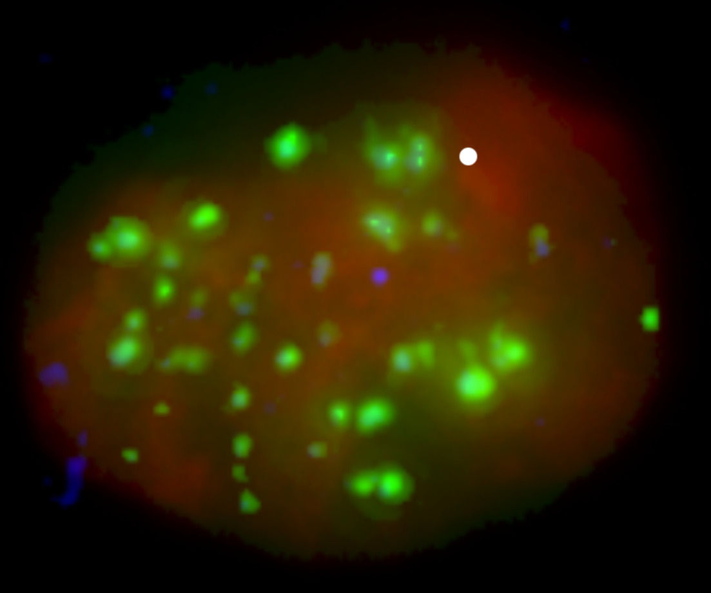

# DNA Foci Labeling


<!--  -->

This is simple tool to label DNA foci.

First edit the `config.json` file to select the location of the images and the output directory.

Start the app by:
```
python start.py
```
